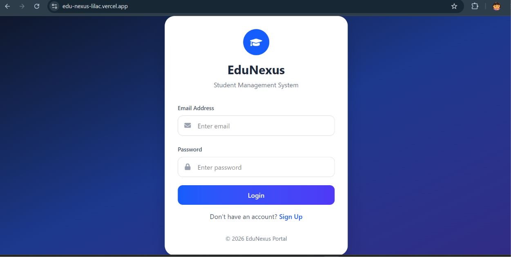

# 🎓 EduNexus – Student Management System


A **full-stack Student Management System** designed to simplify student records, attendance tracking, fee management, and course administration through a modern, secure, and responsive web application.

---

## 📖 Overview

EduNexus is a collaborative academic project developed to digitize educational institution workflows. It enables administrators and students to manage academic information efficiently through role-based access, authentication, and an interactive dashboard.

---

## 📸 Preview



---

## 🚀 Live Demo

🌐 **Frontend**  
https://edu-nexus-lilac.vercel.app/

⚙️ **Backend API**  
https://edunexus-backend-ps02.onrender.com/

---

## ✨ Features

### 🔐 Authentication

- User Registration
- Secure Login
- JWT Authentication
- Role-Based Access Control
- Protected Routes

### 👨‍🎓 Student Dashboard

- Student Profile
- Attendance Progress
- Notifications
- Personal Task Manager
- Dark Mode Support

### 👨‍💼 Admin Dashboard

- Add Student
- Update Student
- Delete Student
- Student Records
- Dashboard Analytics
- Recent Activity

### 📅 Attendance Management

- Mark Attendance
- Attendance Records
- Attendance Statistics

### 💰 Fee Management

- Add Fee Records
- Payment Status Tracking
- Fee Information

### 📚 Course Management

- Add Courses
- Manage Courses
- View Course Information

### 🎨 User Interface

- Responsive Design
- Glassmorphism UI
- Dark Mode
- Interactive Charts
- Mobile Friendly

---

## 🛠 Tech Stack

### Frontend

- React.js
- React Router DOM
- Axios
- Tailwind CSS
- React Icons

### Backend

- Node.js
- Express.js
- JWT Authentication
- bcryptjs

### Database

- MySQL

### Deployment

- Vercel
- Render

---

## 📂 Project Structure

```text
EduNexus
│
├── frontend
│   ├── src
│   ├── components
│   ├── pages
│   └── context
│
├── backend
│   ├── config
│   ├── controllers
│   ├── middleware
│   ├── models
│   └── routes
│
└── README.md
```

---

## 🚀 Getting Started

### Clone Repository

```bash
git clone https://github.com/myselfsneha/EduNexus.git
```

### Install Dependencies

```bash
npm install
```

### Run Development Server

```bash
npm run dev
```

---

## 👥 Team Members

- Sneha Singh
- Tirthi Jhamar
- Oshi Kanungo
- Shivani Parmar
- Khushi Rathod

---

## 🎯 Future Enhancements

- Profile Picture Upload
- Email Notifications
- PDF Report Generation
- Student Performance Analytics
- Cloud File Storage
- Real-Time Dashboard Updates

---

## 👩‍💻 Author

**Sneha Singh**

🌐 Portfolio: https://myselfsneha.github.io/sneha-portfolio/

💼 LinkedIn: https://www.linkedin.com/in/singh--sneha/

💻 GitHub: https://github.com/myselfsneha

---

## 📄 License

This project was developed for educational and learning purposes.

⭐ If you found this project helpful, consider giving it a star!
